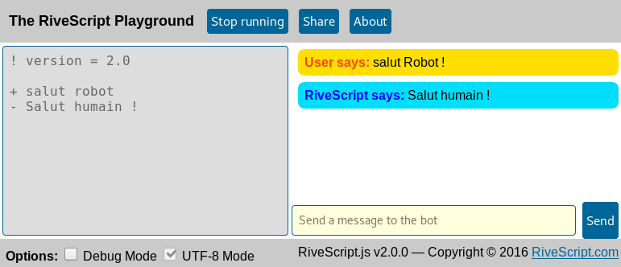

# Les bases de RiveScript

## C'est quoi RiveScript ?

RiveScript est un **language de programmation** qui sers à programmer des **chatbots**.

## Le RiveScript Playground

Pour commencer à utiliser RiveScript, une bonne solution est d'aller sur l'*aire de jeu RiveScript* : [play.rivescript.com](http://play.rivescript.com).

Une fois sur cette page, vous pouvez suprimer tout le contenu de la zone jaune et cocher la case `UTF-8 Mode`.

Pour la suite on écrira notre code dans la partie de gauche (jaune), et on appuiera sur `Run` pour le tester dans la partie droite.

## Premiers pas

Écrivons notre premier code RiveScript !

```
+ salut robot
- Salut humain !
```

Écrivez ce code dans la partie jaune du *RiveScript Playground*, appuyez sur `Run`.

Maintenant écrivez "Salut robot." et appuyez sur `Send`. Le robot vous répond !



### Explication du code

dans un code RiveScript, chaque ligne est une commande. Pour savoir de quelle type de commande il s'agît il suffit de regarder symbole en début de ligne (dans cet exemple on voit les symboles `+` et `-`)

#### Commande de déclancheur `+`
La commande `+` sers à définir un **déclancheur**. Un déclancheur est une ligne de texte qui sers à reconnaitre le message de l'utilisateur

#### Commande de réponse `-`
La commande `-` sers à définir les réponses au déclancheur.

### Important !

**Un déclancheur doit toujours être écrit en minuscule et sans ponctuation !**

### Plusieurs réponse pour un même déclancheur

Un même déclancheur peut avoir plusieurs réponses possible, il suffit de mettre plusieurs *commandes de réponse*.

Par exemple :
```
+ ça va
- Oui je vais super bien !
- Bof...
- Bien et toi ?
```

Quand on lui demandera "Ça va ?", le robot choisira une réponse au hasard parmis les trois possible.

### Partager le code

Avant de partager votre code il y a deux petites dernières choses à faire :

#### Indiquer la version de RiveScript utilisée

Nous utilisons la version 2.0 de RiveScript, le RiveScript Playground est au courant mais il faut l'indiquer pour d'autres programmes qui ne le sauraient pas.

Entrez cette ligne tout en haut de votre code :
```
! version = 2.0
```

#### Décrire le rôle du code

Pour que les personnes qui lirons votre code puissent se faire une idéée de ce à quoi il sert, il peut être bien d'ajouter un petit commentaire. En RiveScript, les commentaires commencent par `//`. Vous pouvez par exemple écrire :

```
// Ce code permet de répondre à des salutations basiques.
```

#### Mon code ressemble donc à ceci :

```
! version = 2.0
// Ce code permet de répondre à des salutations basiques.

+ salut robot
- Salut humain !

+ ça va
- Oui je vais super bien !
- Bof...
- Bien et toi ?
```

#### Enfin

J'appuie sur `Share` et j'obtiens un lien que je peux partager à qui je veux.


### La suite...

RiveScript est un language puissant qui permet de faire beaucoup plus de choses que ce qu'on a vu là. Essayez déjà d'exploiter un maximum ce que vous avez appris ici, puis passez à la suite : [Uttilisation avancée de RiveScript](rivescript-avance.md)
